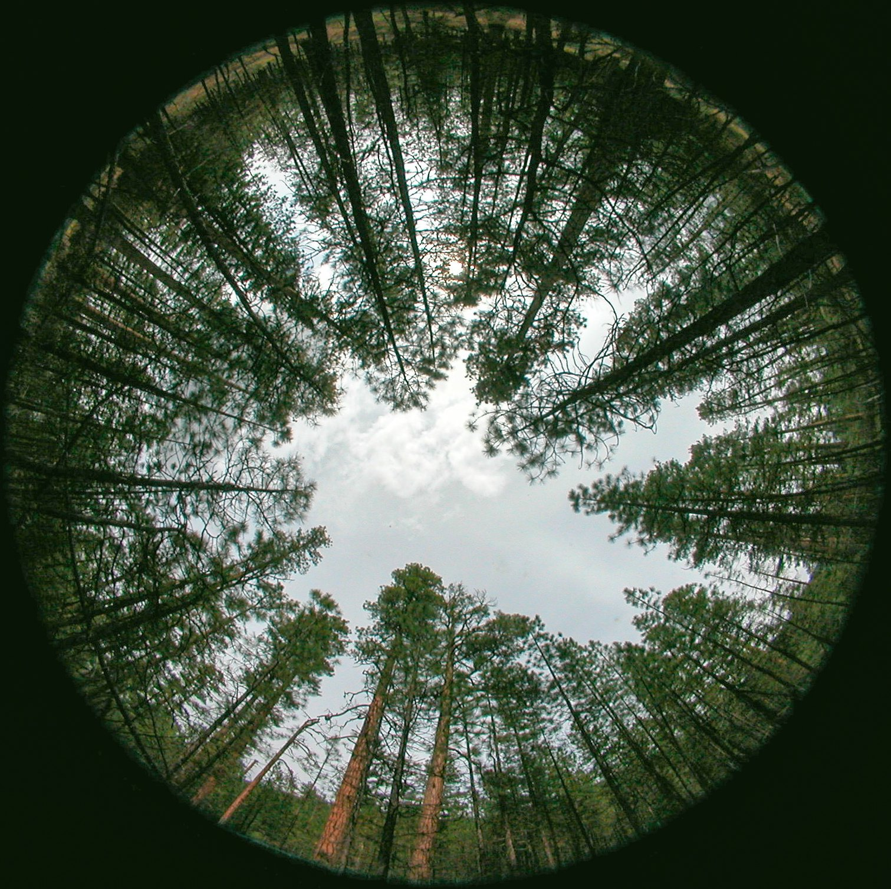
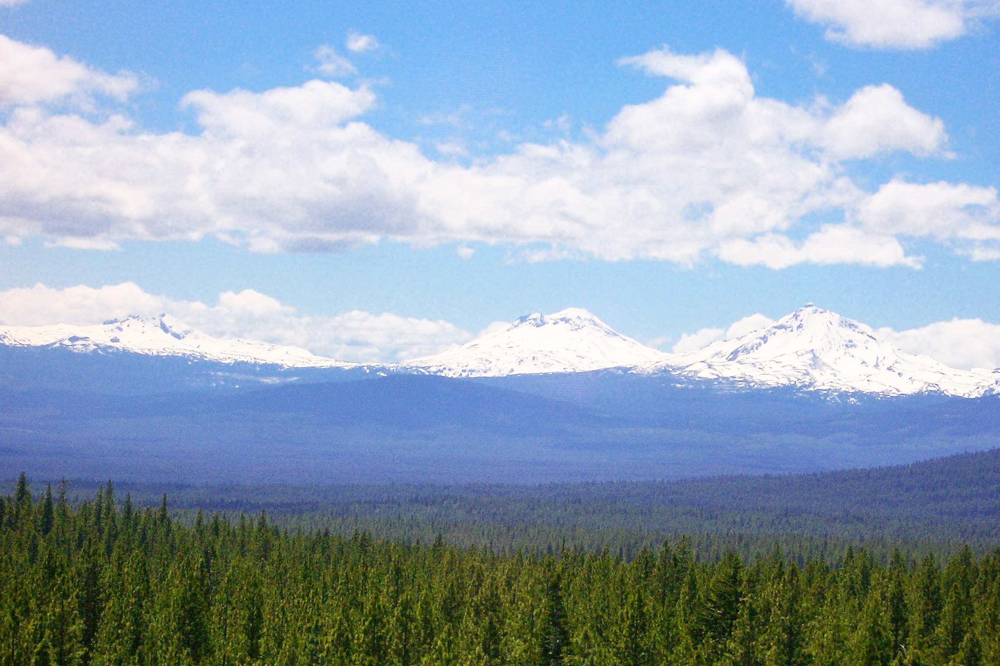
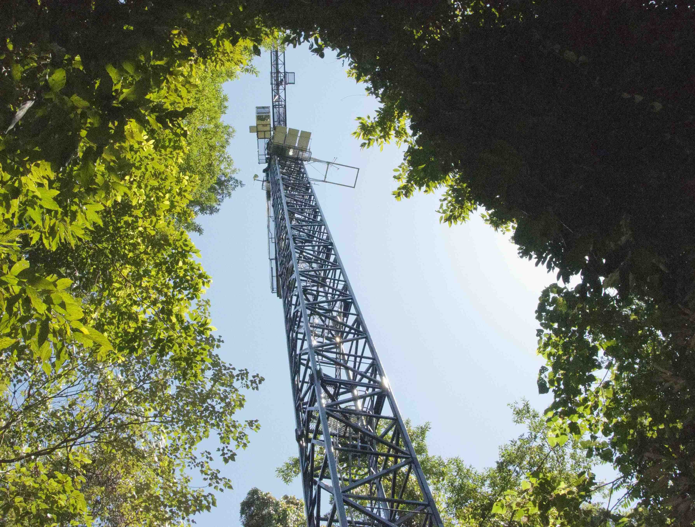
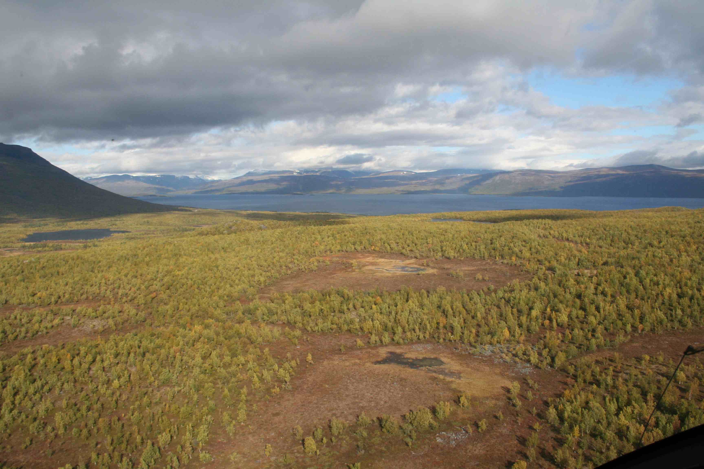

  
  
Dinner! Abisko, Sweden.

  
  
Hemispherical photograph. Oregon, USA.

  
  
View from the Metolius flux tower. Oregon, USA.

  
  
Daintree Rainforest canopy crane. Cairns, Australia.

  
  
View from the helicopter. Abisko, Sweden

  
  
Grassland elevated CO2 experiment. Tasmania, Australia.

<!-- Global site tag (gtag.js) - Google Analytics -->

