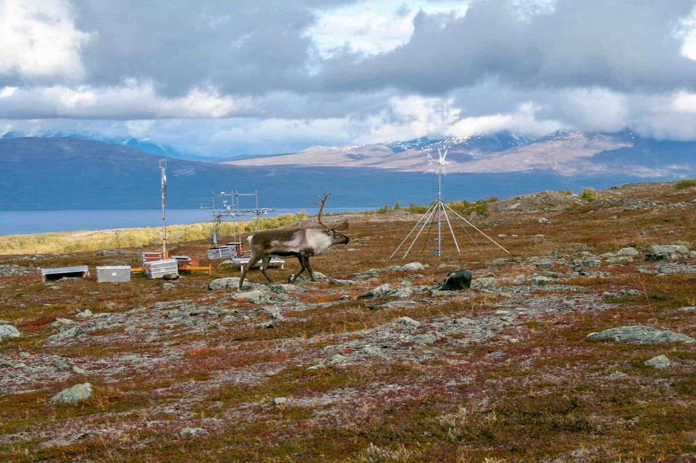
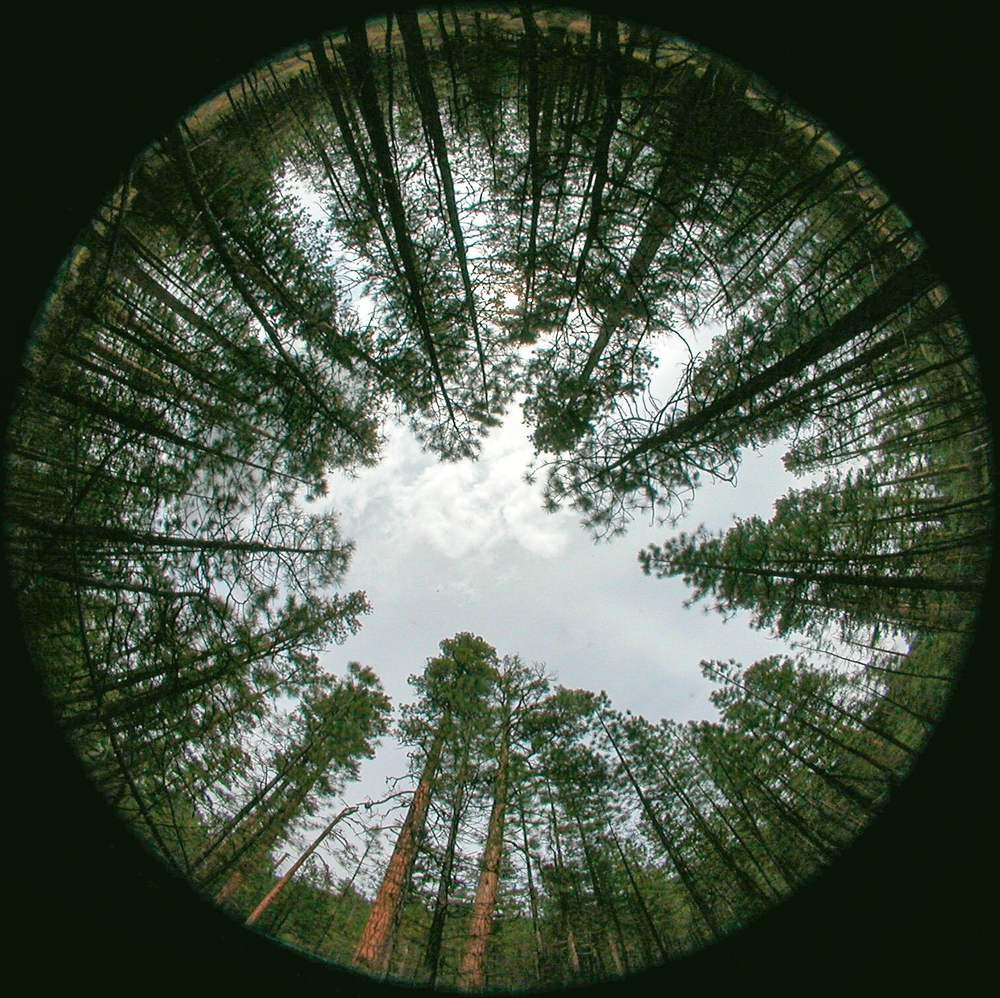
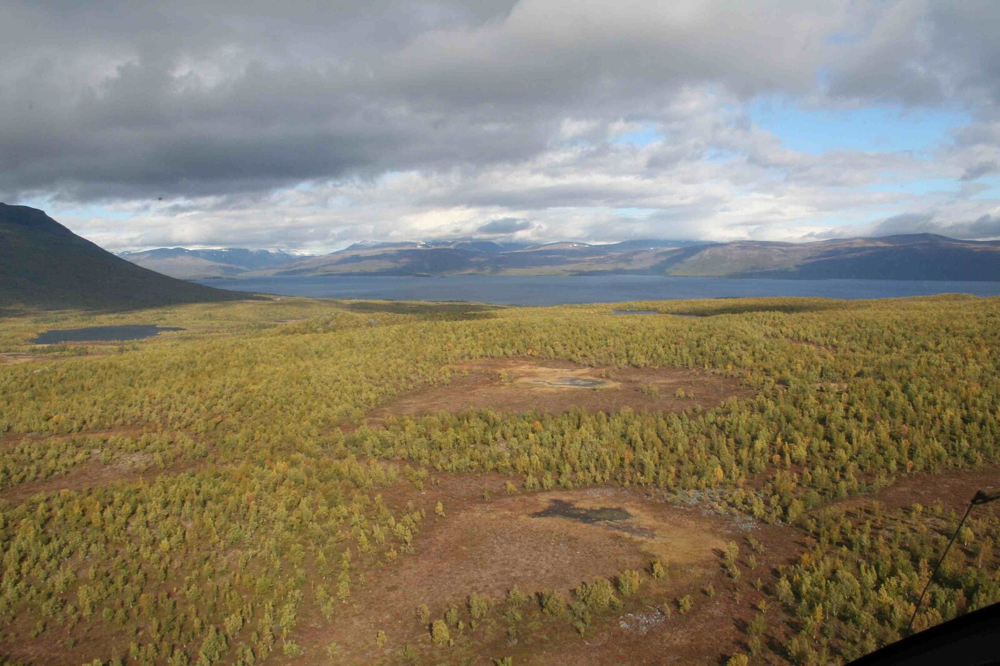
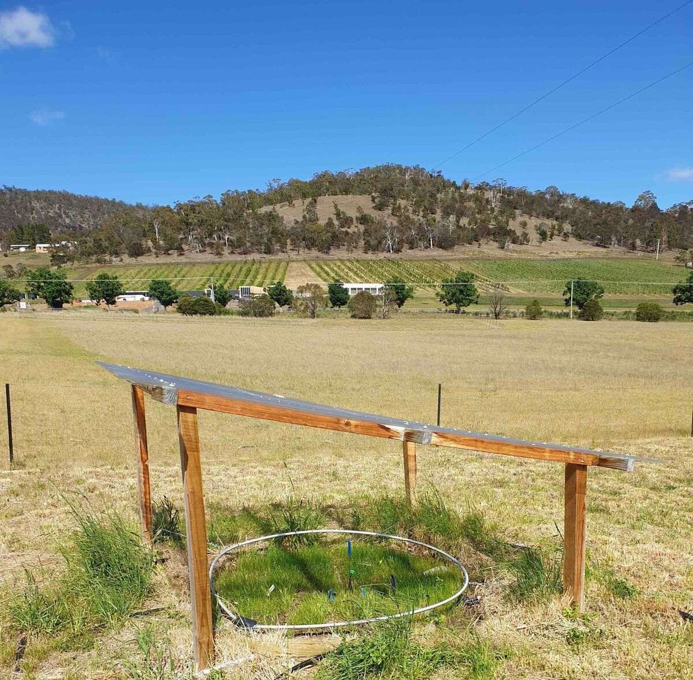
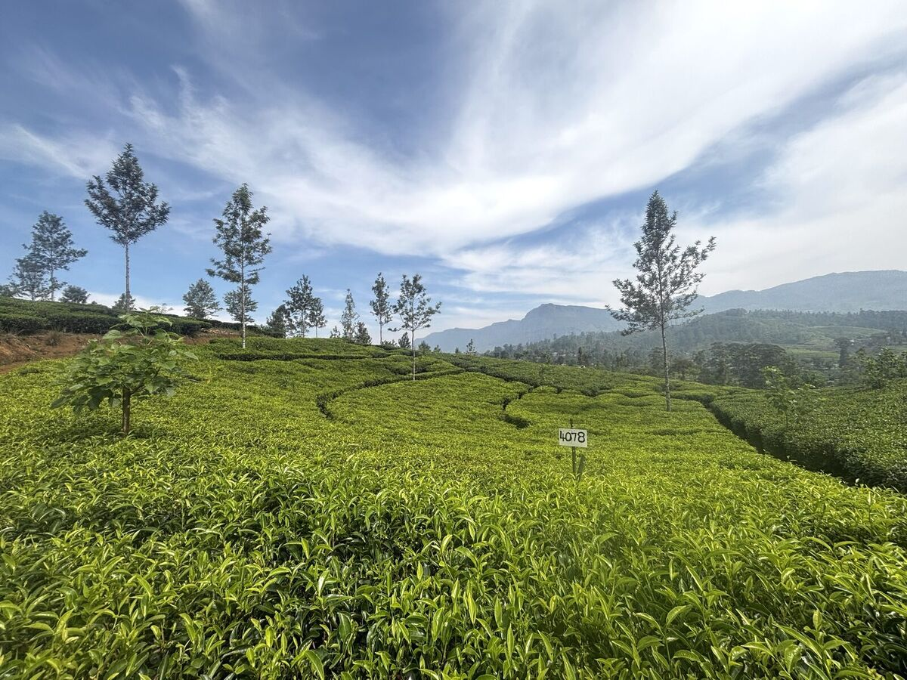
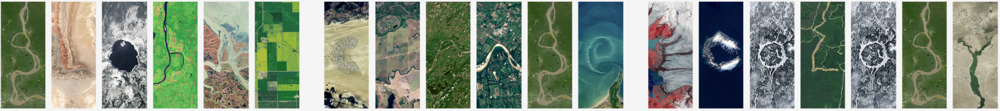

Welcome to the Global Change Ecology Lab at the University of Bristol. We use experiments, observations, and models to understand how plants and ecosystems respond to a changing climate

  
  
Dinner! Abisko, Sweden

  
  
Hemispherical photograph. Oregon, USA

  
  
View from the Metolius flux tower. Oregon, USA

  
  
Daintree Rainforest canopy crane. Cairns, Australia

  
  
View from the helicopter. Abisko, Sweden

  
  
Grassland elevated CO2 experiment. Tasmania, Australia

  
  
Tea fields. Talawakele, Sri Lanka

  
  

  

