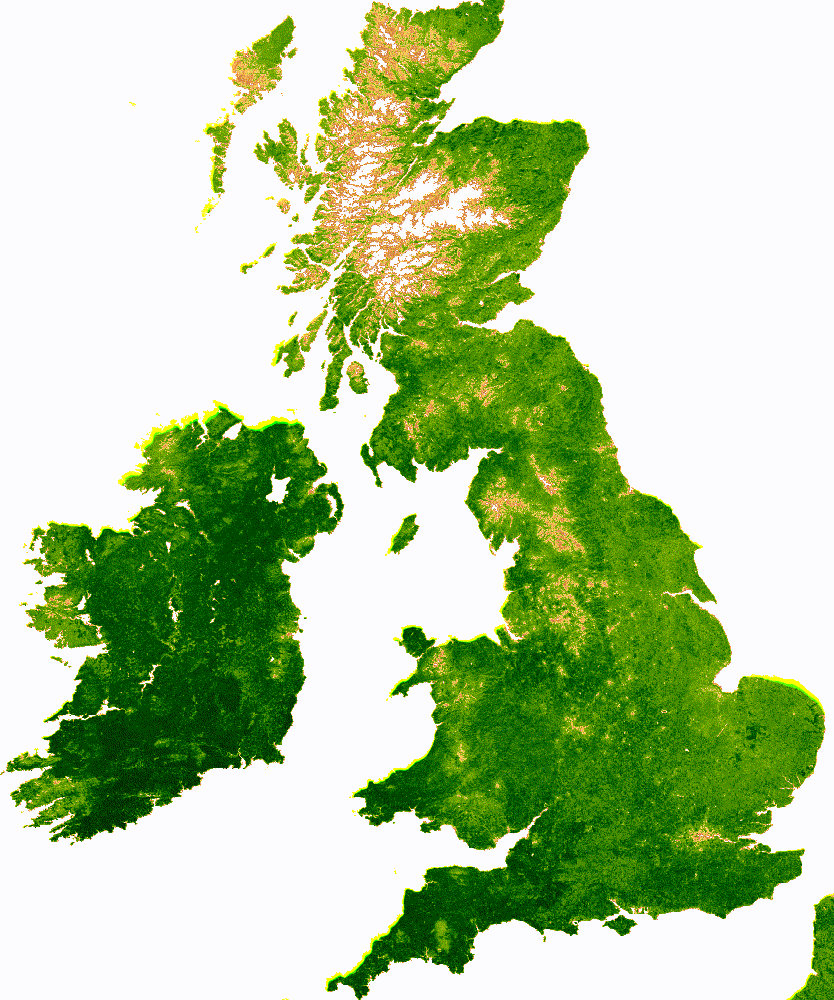

Potential students that have an interest in exploring research questions related to the response of the carbon and water cycles to global change are  encouraged to get in contact. Students should have a background in biology, mathematics, physics, atmospheric science, engineering or a similar quantitative sciences.

I would also be very keen to welcome visitors so please get in contact!

The city of Bristol is a great place to <a href="https://visitbristol.co.uk/inspire/all-about-bristol" style="color:#16a085">work and live.</a>

### Current opportunities:

- We are recruiting an 18-month Postdoctoral researcher with expertise in either: land surface model development or machine learning approaches. The role will focus on advancing our ability to forecast the legacy effects of drought and heat extremes. The role should be advertsied very soon...

- We are recruiting a NERC PhD student to work on a: <a href="https://www.findaphd.com/phds/project/funded-phd-nerc-gw4-dltp-forests-on-the-edge-examining-vegetation-recovery-following-climate-extremes/?p177600" style="color:#16a085">Forests on the edge: examining vegetation recovery following climate extremes</a>. This PhD is co-supervised by Prof. Lina Mercado at the University of Exeter and Dr Eddy Robertson at the UK Met Office. The deadline to apply is: Monday 13 January, 2025. Application details can be found: <a href="https://www.findaphd.com/phds/project/funded-phd-nerc-gw4-dltp-forests-on-the-edge-examining-vegetation-recovery-following-climate-extremes/?p177600" style="color:#16a085"> by clicking here </a>.

- We are recruiting a funded PhD opportunity on <a href="https://exeter.ac.uk/study/funding/award/?id=5421" style="color:#16a085">social behaviour in the context of ecological disturbance</a>. The Phd is supervised by Lauren Brent, Joah Madden (both at Exeter) and me (Bristol). September 2025 start, please apply by Jan 13. Details can be found: <a href="https://exeter.ac.uk/study/funding/award/?id=5421" style="color:#16a085">by clicking here</a>

- We are recruiting a funded PhD on <a href="https://www.findaphd.com/phds/project/funded-phd-open-to-uk-domiciled-home-fee-applicants-of-black-african-black-caribbean-or-other-black-or-mixed-black-heritage-forests-on-the-edge-examining-the-legacy-of-summer-climate-extremes/?p176173" style="color:#16a085">"Forests on the edge: examining the legacy of summer climate extremes"</a>. The PhD is open to UK-domiciled, home fee applicants of Black African, Black Caribbean or other Black or mixed Black heritage. Details can be found: <a href="https://www.findaphd.com/phds/project/funded-phd-open-to-uk-domiciled-home-fee-applicants-of-black-african-black-caribbean-or-other-black-or-mixed-black-heritage-forests-on-the-edge-examining-the-legacy-of-summer-climate-extremes/?p176173" style="color:#16a085">by clicking here</a>.

### Graduate:

- <a href="https://www.bristol.ac.uk/study/postgraduate/2022/doctoral/phd-great-western-four-dtp/" style="color:#16a085">NERC-funded PhD studentships</a> primarily open to UK students with a limited number for international students

- <a href="https://www.swbio.ac.uk/" style="color:#16a085">South West Biosciences PhD studentships</a> primarily open to UK students with a limited number (~30%) for international students

- <a href="https://bristol.ac.uk/life-sciences/study/postgraduate/fundedstudentships/" style="color:#16a085">Bristol's International PhD studentships </a> more information for international students can be found <a href="https://bristol.ac.uk/study/postgraduate/international/" style="color:#16a085">here.</a> Country specific information to help you translate Bristol's grade expectations can be found <a href="http://www.bristol.ac.uk/international/countries/" style="color:#16a085">here</a>

- <a href="http://www.bristol.ac.uk/biology/bcai/lady-emily-smyth-studentships/" style="color:#16a085">Lady Emily Smyth studentships</a> open to MRes students

- <a href="https://www.bristol.ac.uk/students/support/finances/scholarships/china-scholarship-council/" style="color:#16a085">China Scholarship Council – University of Bristol joint-funded Scholarship</a> are for students from the People's Republic of China

- <a href="https://www.fulbright.org.uk/going-to-the-uk/postgraduate-student-awards/" style="color:#16a085">US-UK Fulbright scholarships</a> are open to US citizens (NB. Dual US-UK citizens are eligible to apply)

- <a href="https://cscuk.fcdo.gov.uk/scholarships/commonwealth-phd-scholarships-for-least-developed-countries-and-fragile-states/" style="color:#16a085">Commonwealth PhD Scholarships</a> are for candidates from least developed countries in the Commonwealth

- <a href="https://www.bristol.ac.uk/students/support/finances/scholarships/zutshi-smith/" style="color:#16a085">Zutshi-Smith Scholarship</a> are for students from India, with preference given to applicants of Kashmiri origin

- <a href="http://www.bristol.ac.uk/cabot/postgraduate-opportunities/cabot-masters/" style="color:#16a085">Master's by Research (MScR)</a> in Global Environmental Challenges

### Fellowships:

There are a number of fellowships available (this list is not exhaustive) and I would be extremely happy to act as mentor and support applicants interested in coming to Bristol, please get in touch!

- <a href="https://royalsociety.org/grants-schemes-awards/grants/newton-international/" style="color:#16a085">Newton International Fellowships</a> scheme is open to non-UK early career scientists

- <a href="https://www.bristol.ac.uk/vc-fellows/" style="color:#16a085">EU Marie Skłodowska-Curie Fellowship</a> scheme is open to EU citizens that would like to work in the UK

- <a href="https://www.hfsp.org/funding/hfsp-funding/postdoctoral-fellowships" style="color:#16a085">Human Frontier Science Program</a>

- <a href="https://www.embo.org/funding/fellowships-grants-and-career-support/postdoctoral-fellowships/" style="color:#16a085">EMBO Postdoctoral Fellowships</a>

- <a href="https://lsrf.org/apply/" style="color:#16a085">Life Sciences Research Foundation postdoctoral scheme</a>

<!-- Global site tag (gtag.js) - Google Analytics -->

