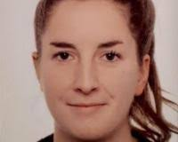

Martin De Kauwe is a Senior Lecturer in the Climate Change Research Centre at the University of New South Wales. In August Martin will be moving to the University of Bristol to take up an Associate Professor position in the <a href="http://www.bristol.ac.uk/biology/" style="color:#16a085;">School of Biological Sciences</a>

 Martin is an Associate Editor of <a href="https://www.biogeosciences.net/" style="color:#16a085;">Biogeosciences</a> and a member of the Editorial Advisory Board for <a href="https://onlinelibrary.wiley.com/journal/13652486" style="color:#16a085;">Global Change Biology</a> and <a href="https://nph.onlinelibrary.wiley.com/journal/14698137" style="color:#16a085;">New Phytologist</a>. Martin is the co-chair of the leadership committee for the <a href="https://trac.nci.org.au/trac/cable/wiki" style="color:#16a085;">CABLE</a> land surface model. Martin is also a member of the Scientific Steering Committee for the AmazonFACE experiment.

### Research Positions

2021–present: Associate Professor, School of Biological Sciences, University of Bristol, England.

2017–2021: Senior Lecturer, Climate Change Research Centre, University of New South Wales, Australia.

2010–2017: Research Fellow, Department of Biological Sciences, Macquarie University, Australia.

2008–2010:  Earth Observation and Land Surface Modeller, Centre for Ecology and Hydrology, England.

### Education

2009: PhD in Remote Sensing, University College London, UK. Title: "Estimating terrestrial carbon fluxes through an optimal combination of models and Earth Observation data" . Supervised by Professors Philip Lewis, Mat Disney and Mathew Williams.

2004: MSc in Environmental Monitoring, Modelling and Management, Kings College London, UK.

2003: BSc in Geography, Kings College London, UK.

<a href="mailto:mdekauwe@gmail.com" class="social-links__entry" target="_blank"> <i class="fa fa-envelope-square fa-lg"></i></a> <a href="https://github.com/mdekauwe" class="social-links__entry" target="_blank"> <i class="fa fa fa-github fa-lg"></i></a> <a href="https://scholar.google.com.au/citations?user=ka3U7xcAAAAJ&hl=en" class="social-links__entry" target="_blank"> <i class="fa fa-google fa-lg">scholar</i></a> <a href="https://twitter.com/mdekauwe82" class="social-links__entry" target="_blank"> <i class="fa fa-twitter fa-lg"></i></a>

&nbsp;

Sami Rifai is a Postdoctoral Researcher at the University of New South Wales.

Sami is working on the ARC grant exploring how vulnerable eucalypts are to future droughts.

<a href="mailto:srifai@gmail.com" class="social-links__entry" target="_blank"> <i class="fa fa-envelope-square fa-lg"> </i></a>

&nbsp;

&nbsp;

&nbsp;

Jonathan Page is a PhD student at the University of New South Wales.

Thesis: *Lags and legacies: understanding the role of antecedent effects on grassland biomass responses to rising CO2* 

<a href="mailto:jon.page@unsw.edu.au" class="social-links__entry" target="_blank"> <i class="fa fa-envelope-square fa-lg"> </i></a>

&nbsp;

&nbsp;

Melika Missen is a PhD student at the University of Tasmania.

Thesis: *Will rising CO2 concentrations save plants from drought stress?* 

<a href="mailto:jmelika.missen@utas.edu.au" class="social-links__entry" target="_blank"> <i class="fa fa-envelope-square fa-lg"> </i></a>

&nbsp;

&nbsp;

&nbsp;

Lina Teckentrup is a PhD student at the University of New South Wales.

Thesis: *The response of terrestrial ecosystems to different climate modes* 

<a href="mailto:l.teckentrup@unsw.edu.au" class="social-links__entry" target="_blank"> <i class="fa fa-envelope-square fa-lg"> </i></a>

&nbsp;

&nbsp;

Mengyuan Mu is a PhD student at the University of New South Wales.

Thesis: *How important is groundwater to the resilience of vegetation during drought?* 

<a href="mailto:mengyuan.mu@student.unsw.edu.au" class="social-links__entry" target="_blank"> <i class="fa fa-envelope-square fa-lg"> </i></a>

&nbsp;

&nbsp;

Manon Sabot is a PhD student at the University of New South Wales.

Thesis: *Trading water for carbon: exploring optimality theory to improve model predictions of vegetation function during drought* 

<a href="mailto:m.sabot@unsw.edu.au" class="social-links__entry" target="_blank"> <i class="fa fa-envelope-square fa-lg"> </i></a>

&nbsp;

&nbsp;

## Alumni

Jinyan (Jim) Yang was a PhD student at Western Sydney University.

Thesis: *Modelling the carbon uptake of Australian evergreen ecosystems under rising [CO2] and water limitations* 

Jim is now working as a Postdoc at Western Sydney University

<a href="mailto:Jinyan.Yang@westernsydney.edu.au" class="social-links__entry" target="_blank"> <i class="fa fa-envelope-square fa-lg"> </i></a>

&nbsp;

&nbsp;

&nbsp;

Ned Haughton was a PhD student at the University of New South Wales.

Thesis: *On the predictability of land surface fluxes* 

Ned is now working as a risk analyst at Climate Risk

&nbsp;

&nbsp;

<!-- Global site tag (gtag.js) - Google Analytics -->

