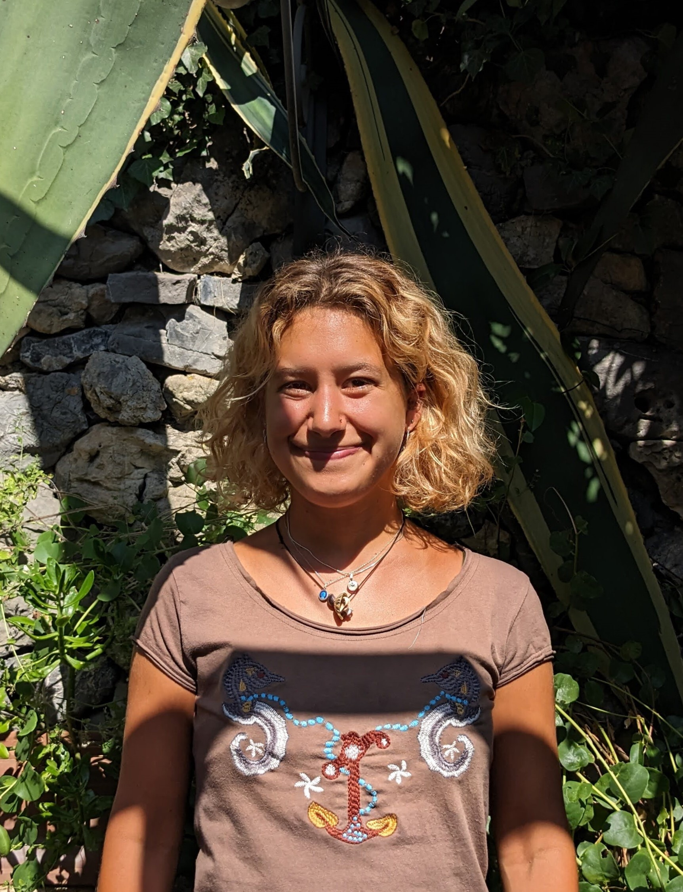
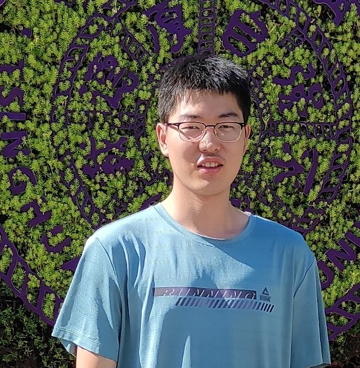
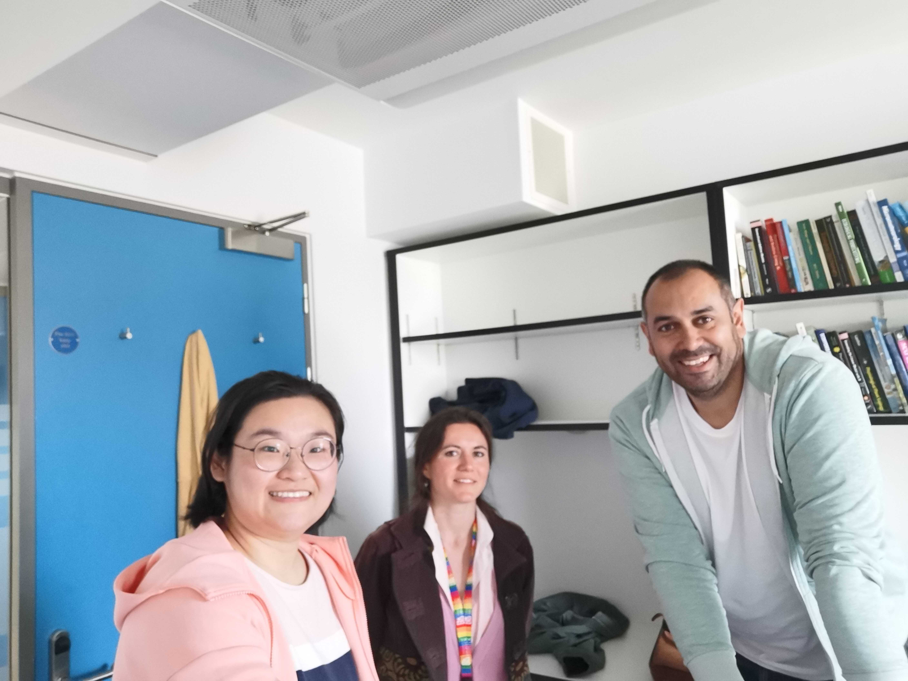

Martin De Kauwe is an Associate Professor of Global Change Ecology at the <a href="http://www.bristol.ac.uk/biology/" style="color:#16a085;">University of Bristol</a>.

 Martin is the Co-Lead of the <a href="http://www.bristol.ac.uk/cabot/" style="color:#16a085;">Cabot Institute for the Environment's</a> Environmental Change theme. He is also a member of the Scientific Steering Committee for the <a href="https://amazonface.inpa.gov.br/en/index.php" style="color:#16a085;">AmazonFACE</a> experiment and part of the senior management team for <a href="https://jules.jchmr.org/" style="color:#16a085;">JULES</a> (the UK land surface model) under the Joint Land Modelling Programme (JLMP). Additionally, Martin previously co-chaired the leadership committee for <a href="https://trac.nci.org.au/trac/cable/wiki" style="color:#16a085;">CABLE</a>, Australia's land surface model. Finally, Martin is an Associate Editor at <a href="https://nph.onlinelibrary.wiley.com/journal/14698137" style="color:#16a085;">New Phytologist</a>.

### Research Positions

2021–present: Associate Professor, School of Biological Sciences, University of Bristol, England

2017–2021: Senior Lecturer, Climate Change Research Centre, University of New South Wales, Australia

2010–2017: Research Fellow, Department of Biological Sciences, Macquarie University, Australia

2008–2010: Land Surface Modeller, Centre for Ecology and Hydrology, England

<a href="mailto:mdekauwe@gmail.com" class="social-links__entry" target="_blank"> <i class="fa fa-envelope-square fa-lg"></i></a> <a href="https://github.com/mdekauwe" class="social-links__entry" target="_blank"> <i class="fa fa fa-github fa-lg"></i></a> <a href="https://scholar.google.com.au/citations?user=ka3U7xcAAAAJ&hl=en" class="social-links__entry" target="_blank"> <i class="fa fa-google fa-lg">scholar</i></a> <a href="https://twitter.com/mdekauwe82" class="social-links__entry" target="_blank"> <i class="fa fa-twitter fa-lg"></i></a>

<!--
### Education

2009: PhD in Remote Sensing, University College London, UK. Title: "Estimating terrestrial carbon fluxes through an optimal combination of models and Earth Observation data" . Supervised by Professors Philip Lewis, Mat Disney and Mathew Williams.

2004: MSc in Environmental Monitoring, Modelling and Management, Kings College London, UK.

2003: BSc in Geography, Kings College London, UK.
-->

### Research group

Ross Upton is an MRes student at the University of Bristol. Ross's master’s degree will investigate opportunities for developing climate-resilient afforestation schemes.

<a href="mailto:f19577@bristol.ac.uk" class="social-links__entry" target="_blank"> <i class="fa fa-envelope-square fa-lg">

&nbsp;

&nbsp;

&nbsp;

Julia Madurini Hall is a PhD student at the University of Bristol in the <a href="https://www.selvalab.org/" style="color:#16a085;">Selva lab </a>. Julia's PhD will use manipulative experiments to advance our understanding of how tress respond to drought and heat stress.

<a href="mailto:julia.hall.2021@bristol.ac.uk" class="social-links__entry" target="_blank"> <i class="fa fa-envelope-square fa-lg">

&nbsp;

&nbsp;

&nbsp;

&nbsp;

Thamali Kariyawasam Idippilige is a PhD student at the University of Bristol. Thamali's PhD will explore tea varieties optimised for cultivation with improved water-use efficiency and greater resilience to drought.

Thamali's PhD scholarship is a partnership between Bristol, the <a href="https://www.kew.org/" style="color:#16a085;">Royal Botanic Gardens, Kew</a>, the <a href="https://www.pdn.ac.lk/" style="color:#16a085;">University of Peradeniya in Sri Lanka</a>, and the
<a href="https://www.tri.lk/" style="color:#16a085;">Tea Research Institute of Sri Lanka</a>, with funding from <a href="https://www.ahmadtea.com/" style="color:#16a085;">Ahmad Tea</a>.

<a href="mailto:er24915@bristol.ac.uk" class="social-links__entry" target="_blank"> <i class="fa fa-envelope-square fa-lg">

&nbsp;

&nbsp;

Cale Baguley is a Postdoctoral Researcher at the University of Bristol.

Cale is working on our UK Natural Environment Research Council (NERC) grant to characterise the timescale, spatial extent, and mechanisms that govern the ecosystem legacy to drought and heatwaves during European summers.

<a href="mailto:jb14389@bristol.ac.uk" class="social-links__entry" target="_blank"> <i class="fa fa-envelope-square fa-lg"> </i></a>
<a href="https://scholar.google.com/citations?user=kvGSPQYAAAAJ&hl=en" class="social-links__entry" target="_blank"> <i class="fa fa-google fa-lg">scholar</i></a>

&nbsp;

&nbsp;

&nbsp;

## Alumni

Ziqi Zhu, visiting PhD student from Tsinghua Univerisity. Ziqi is applying eco-evolutionary optimality principles to understand trends in seasonal dynamics in leaf growth.

<a href="mailto:zq-zhu20@mails.tsinghua.edu.cn" class="social-links__entry" target="_blank"> <i class="fa fa-envelope-square fa-lg"> </i></a>
<a href="https://www.researchgate.net/profile/Ziqi-Zhu-10/publications" class="social-links__entry" target="_blank"> <i class="fa fa-google fa-lg">scholar</i></a>

&nbsp;

&nbsp;

Ying Hu, visiting PhD student from the Research Center for Eco-environmental Sciences, Chinese Academy of Sciences. Ying is exploring the impact of climate change on Chinese terrestrial ecosystems.

<a href="mailto:huying20@mails.ucas.ac.cn" class="social-links__entry" target="_blank"> <i class="fa fa-envelope-square fa-lg"> </i></a>
<a href="https://scholar.google.com.au/citations?hl=en&user=oo7FaoYAAAAJ" class="social-links__entry" target="_blank"> <i class="fa fa-google fa-lg">scholar</i></a>

&nbsp;

&nbsp;

Melika Missen, PhD student, Thesis: *Will rising CO2 concentrations save plants from drought stress?* 

Melika has just passed her PhD!

<a href="mailto:jmelika.missen@utas.edu.au" class="social-links__entry" target="_blank"> <i class="fa fa-envelope-square fa-lg"> </i></a>
<a href="https://scholar.google.com/citations?user=RJHRL60AAAAJ&hl=en" class="social-links__entry" target="_blank"> <i class="fa fa-google fa-lg">scholar</i></a>

&nbsp;

&nbsp;

Jonathan Page, PhD student, Thesis: *Lags and legacies: understanding the role of antecedent effects on grassland biomass responses to rising CO2* . Jon recieved the Dean’s Award for an outstanding PhD thesis.

John is now working as a postdoc at the University of New South Wales.

<a href="mailto:jon.page@unsw.edu.au" class="social-links__entry" target="_blank"> <i class="fa fa-envelope-square fa-lg"> </i></a>
<a href="https://scholar.google.com.au/citations?hl=en&user=yEtrmdMAAAAJ" class="social-links__entry" target="_blank"> <i class="fa fa-google fa-lg">scholar</i></a>

&nbsp;

Gabriel Banstarck Marandola, visiting master's student from the State University of Campinas. Gabriel completed his MSc in Ecology in 2024.

Gabriel's thesis evaluated the effects of elevated CO2 on the physiology of understory species in Central Amazonia.

<a href="mailto:g171857@dac.unicamp.br" class="social-links__entry" target="_blank"> <i class="fa fa-envelope-square fa-lg"> </i></a>

&nbsp;

Chunhui Zhan, visiting PhD student from the Max Planck Institute for Biochemistry.

Chunhui is examining the role of rising carbon dioxide on land-atmosphere interactions.

<a href="mailto:czhan@bgc-jena.mpg.de" class="social-links__entry" target="_blank"> <i class="fa fa-envelope-square fa-lg"> </i></a>
<a href="https://www.bgc-jena.mpg.de/person/czhan/4908500" class="social-links__entry" target="_blank"> <i class="fa fa-google fa-lg">scholar</i></a>

&nbsp;

&nbsp;

&nbsp;

&nbsp;

Lina Teckentrup, PhD student, Thesis: *The Future of Terrestrial Carbon in Australia* 

Lina is now working as a research scientist at the Barcelona Supercomputer Center.

<a href="mailto:l.teckentrup@unsw.edu.au" class="social-links__entry" target="_blank"> <i class="fa fa-envelope-square fa-lg"> </i></a>
<a href="https://scholar.google.com.au/citations?hl=en&user=MzjKIsoAAAAJ" class="social-links__entry" target="_blank"> <i class="fa fa-google fa-lg">scholar</i></a>

&nbsp;

&nbsp;

Mengyuan Mu, PhD student, Thesis: *How important is groundwater to the resilience of vegetation during drought?* 

Mengyuan is now working as a Postdoc at the University of New South Wales.

<a href="mailto:mengyuan.mu@unsw.edu.au" class="social-links__entry" target="_blank"> <i class="fa fa-envelope-square fa-lg"> </i></a>
<a href="https://scholar.google.com.au/citations?hl=en&user=e5bnO9gAAAAJ" class="social-links__entry" target="_blank"> <i class="fa fa-google fa-lg">scholar</i></a>

&nbsp;

&nbsp;

Manon Sabot, PhD student Thesis: *Trading water for carbon in a changing climate: Can optimality theory improve the predictability of land surface models?*  Manon recieved the Dean’s Award for an outstanding PhD thesis. Following her PhD, Manon worked as a Postdoctoral Researcher on our ARC grant exploring how vulnerable eucalypts are to future drought.

Manon is a Minerva Fast Track fellow and group leader at the <a href="https://www.bgc-jena.mpg.de/person/msabot/4777702" style="color:#16a085;">Max Planck Institute for Biogeochemistry</a>.

<a href="mailto:msabot@bgc-jena.mpg.de" class="social-links__entry" target="_blank"> <i class="fa fa-envelope-square fa-lg"> </i></a>
<a href="https://scholar.google.com.au/citations?hl=en&user=Pce-a8UAAAAJ" class="social-links__entry" target="_blank"> <i class="fa fa-google fa-lg">scholar</i></a>

Sami Rifai, Postdoctoral Researcher on the ARC Discovery: "How vulnerable are eucalypts to future droughts?"

Sami now a lecturer in the School of Biological Sciences at the <a href="https://researchers.adelaide.edu.au/profile/sami.rifai" style="color:#16a085;">University of Adelaide</a>.

<a href="https://scholar.google.com.au/citations?hl=en&user=2GmEDKAAAAAJ" class="social-links__entry" target="_blank"> <i class="fa fa-google fa-lg">scholar</i></a>

&nbsp;

&nbsp;

Jinyan (Jim) Yang, PhD student, Thesis: *Modelling the carbon uptake of Australian evergreen ecosystems under rising [CO2] and water limitations* 

Jim is now working as a Postdoc at CSIRO Environment.

<a href="https://scholar.google.com.au/citations?hl=en&user=6f7VyFoAAAAJ" class="social-links__entry" target="_blank"> <i class="fa fa-google fa-lg">scholar</i></a>

&nbsp;

&nbsp;

&nbsp;

Ned Haughton, PhD student, Thesis: *On the predictability of land surface fluxes* 

Ned is now working as a risk analyst at Climate Risk.

<a href="https://scholar.google.com.au/citations?hl=en&user=iMq-xHEAAAAJ" class="social-links__entry" target="_blank"> <i class="fa fa-google fa-lg">scholar</i></a>

&nbsp;

&nbsp;

### Mini reunion in Bristol, 2022

<!-- Global site tag (gtag.js) - Google Analytics -->

