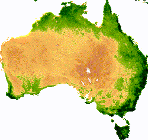
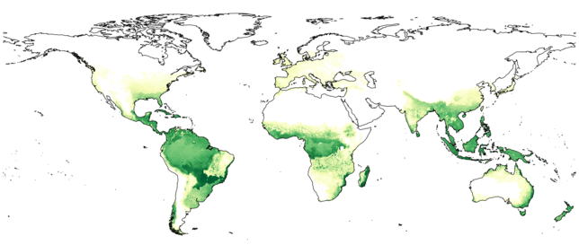
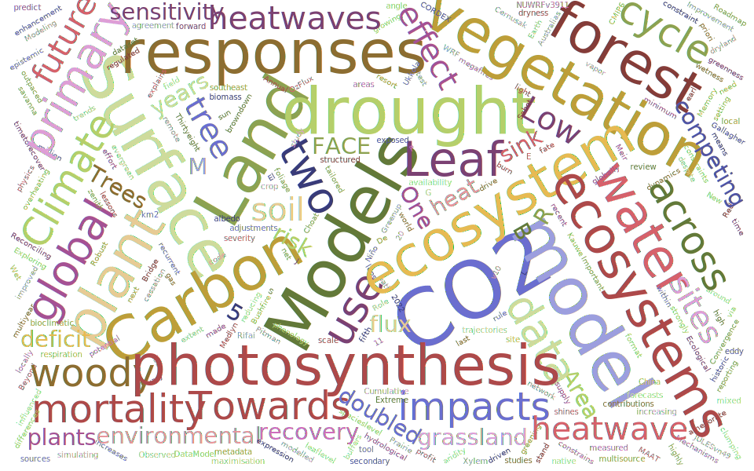

Our research group focuses on understanding how plants respond to global environmental change: increasing CO2, temperature, and changing water availability. We integrate a range of observation streams (*e.g.*, manipulation experiments, eddy covariance, and satellite data) with vegetation models to improve our understanding and capacity to predict future ecosystem change.

We tackle a diverse range of questions that connect terrestrial ecosystems with climate, including:

- how will plants respond to increasing atmospheric CO2 concentration?
- can we predict when & where trees might die of drought-induced mortality?
- what acclimation potential do plants have to projected warming & drought?
- what role does legacy to past environmental conditions play in our capacity to predict ecosystem resilience?
- how does plant physiology affect land-atmosphere feedbacks during climate extremes?
- what impact will plants have on the future hydrological cycle?
- how resilient are species distributions to climate change & how will distributions shift in the future?
- what role do urban trees play in mitigating climate-related warming & what species should we be planting in cities of the future?

<!-- 

 -->

 Our research group employs models of varying complexity, from simple (<a href="https://github.com/mdekauwe/GDAY" style="color:#16a085">GDAY</a>), to the more complex: stand (<a href="http://maespa.github.io/" style="color:#16a085;">MAESPA</a>), land surface (<a href="https://trac.nci.org.au/trac/cable/wiki" style="color:#16a085;">CABLE</a>, <a href="https://jules.jchmr.org/" style="color:#16a085;">JULES</a>), dynamic vegetation (<a href="http://iis4.nateko.lu.se/lpj-guess/" style="color:#16a085;">LPJ-GUESS</a>; SDGVM) and coupled-climate (<a href="https://www.csiro.au/en/Research/OandA/Areas/Assessing-our-climate/CAWCR/ACCESS" style="color:#16a085;">ACCESS</a>) models. 

<i> "The method of science depends on our attempts to describe the world with simple theories: theories that are complex may become untestable, even if they happen to be true. Science may be described as the art of systematic over-simplification-the art of discerning what we may with advantage omit" </i> - Karl Popper 

<!-- Global site tag (gtag.js) - Google Analytics -->

