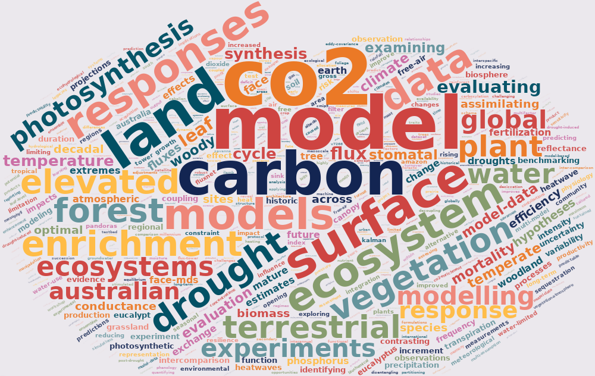

Our research group investigates how plants respond to global environmental changes, including rising CO2, increasing temperatures, and shifting water availability. We integrate diverse observation streams — such as manipulation experiments, eddy covariance, and satellite data — with vegetation models and statistical methods to enhance our understanding and improve predictions of future ecosystem change.

<!-- 

 -->

We tackle a diverse range of questions that connect terrestrial ecosystems with climate, including:

- how will plants adapt to increasing atmospheric CO2 concentration?
- can we predict when & where trees will die during droughts?
- to what extent can plants adjust their function in response to stress?
- how do past environmental conditions influence our ability to predict ecosystem resilience?
- how does plant function influence land-atmosphere feedbacks during climate extremes?
- how will plant responses to environmental change affect the hydrological cycle?
- how resilient are species distributions to climate change, and how will these distributions shift in the future?
- what role do urban trees play in mitigating climate-related warming, and which species should we plant in cities of the future?

 Modelling is central tool used by our research group to understand, disentangle and project how climate and climate change will shape future vegetation-atmosphere dynamics. Our group employs models of varying complexity, from simple (<a href="https://github.com/mdekauwe/GDAY" style="color:#16a085">GDAY</a>), to the more complex: stand (<a href="http://maespa.github.io/" style="color:#16a085;">MAESPA</a>), land surface (<a href="https://trac.nci.org.au/trac/cable/wiki" style="color:#16a085;">CABLE</a>, <a href="https://jules.jchmr.org/" style="color:#16a085;">JULES</a>), dynamic vegetation (<a href="http://iis4.nateko.lu.se/lpj-guess/" style="color:#16a085;">LPJ-GUESS</a>; SDGVM) and coupled-climate (<a href="https://www.csiro.au/en/Research/OandA/Areas/Assessing-our-climate/CAWCR/ACCESS" style="color:#16a085;">ACCESS</a>) models. 

<i> "The method of science depends on our attempts to describe the world with simple theories: theories that are complex may become untestable, even if they happen to be true. Science may be described as the art of systematic over-simplification-the art of discerning what we may with advantage omit" </i> - Karl Popper 

<!-- Global site tag (gtag.js) - Google Analytics -->

