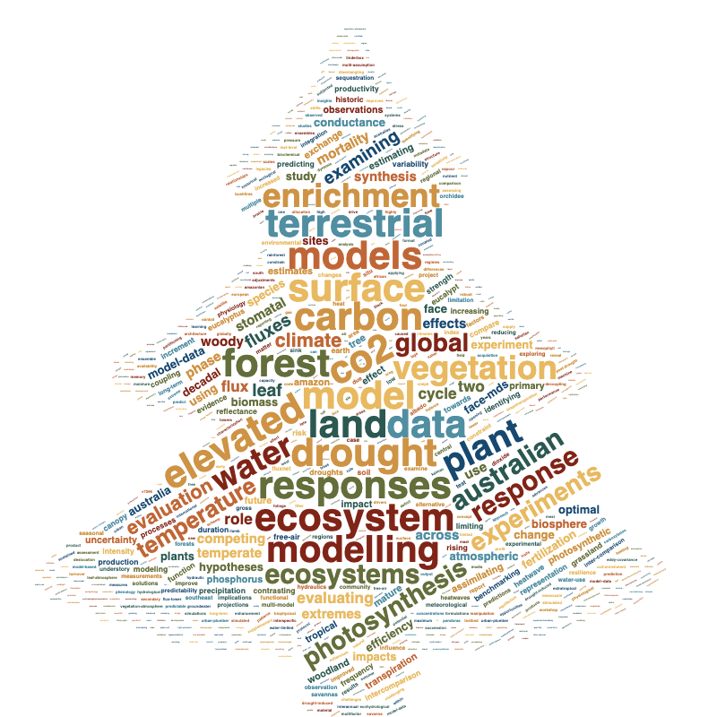

Our research group investigates how plants respond to global environmental changes, including rising CO2, increasing temperatures, and shifting water availability. We integrate diverse observation streams — such as manipulation experiments, eddy covariance, and satellite data — with vegetation models and statistical methods to enhance our understanding and improve predictions of future ecosystem change.

<!-- 

 -->

We tackle a diverse range of questions that connect terrestrial ecosystems with climate, including:

- How will plants acclimate and adapt to rising atmospheric CO2 concentration?
- To what extent can plants adjust their physiology and function under environmental stress?
- Can we predict when and where trees with die during droughts?
- Can we anticipate how changing disturbance regimes will reshape forest structure, function, and recovery trajectories?
- How do past environmental conditions shape ecosystem resilience to droughts and heatwaves?
- How does plant function regulate land-atmosphere feedbacks during climate extremes?
- How will plant responses to environmental change alter the terrestrial hydrological cycle?
- How resilient are species distributions to climate change, and how will they shift in the future?
- How effectively can nature-based forest restoration mitigate the impacts of droughts and heatwaves?
- Which species should we plant in future landscapes and cities to enhance climate resilience?

 Modelling is central tool used by our research group to understand, disentangle and project how climate change will shape future vegetation-atmosphere dynamics. Our group employs models of varying complexity, from simple (<a href="https://github.com/mdekauwe/GDAY" style="color:#16a085">GDAY</a>), to the more complex: stand (<a href="http://maespa.github.io/" style="color:#16a085;">MAESPA</a>), land surface (<a href="https://trac.nci.org.au/trac/cable/wiki" style="color:#16a085;">CABLE</a>, <a href="https://jules.jchmr.org/" style="color:#16a085;">JULES</a>), dynamic vegetation (<a href="http://iis4.nateko.lu.se/lpj-guess/" style="color:#16a085;">LPJ-GUESS</a>; SDGVM) and coupled-climate (<a href="https://www.csiro.au/en/Research/OandA/Areas/Assessing-our-climate/CAWCR/ACCESS" style="color:#16a085;">ACCESS</a>) models. 

 <i>"The method of science depends on our attempts to describe the world with simple theories: theories that are complex may become untestable, even if they happen to be true. Science may be described as the art of systematic over-simplification-the art of discerning what we may with advantage omit" </i> - Karl Popper

<!-- Global site tag (gtag.js) - Google Analytics -->

