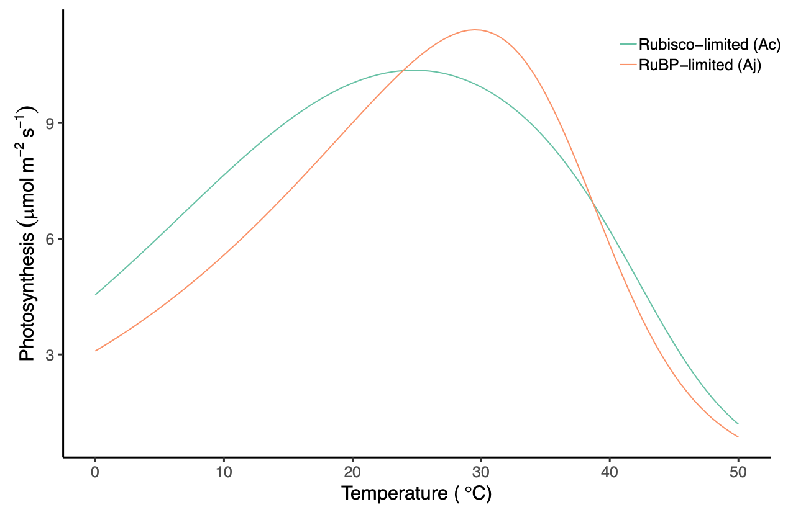

 *University of Bristol* 

- BIOL30022: Future of the Green Planet
- BIOL20022: Animal and Plant Physiology
- BIOL10007: Diversity of Life Part B
- BIOL10009: Life Processes Part A

 *University of New South Wales Sydney* 

- CLIM2001: Fundamentals of Atmospheric Science
- CLIM3001: Climate Systems Science
- BEES3041: Big Data in the Biological, Earth and Environmental Sciences

<!-- Global site tag (gtag.js) - Google Analytics -->

